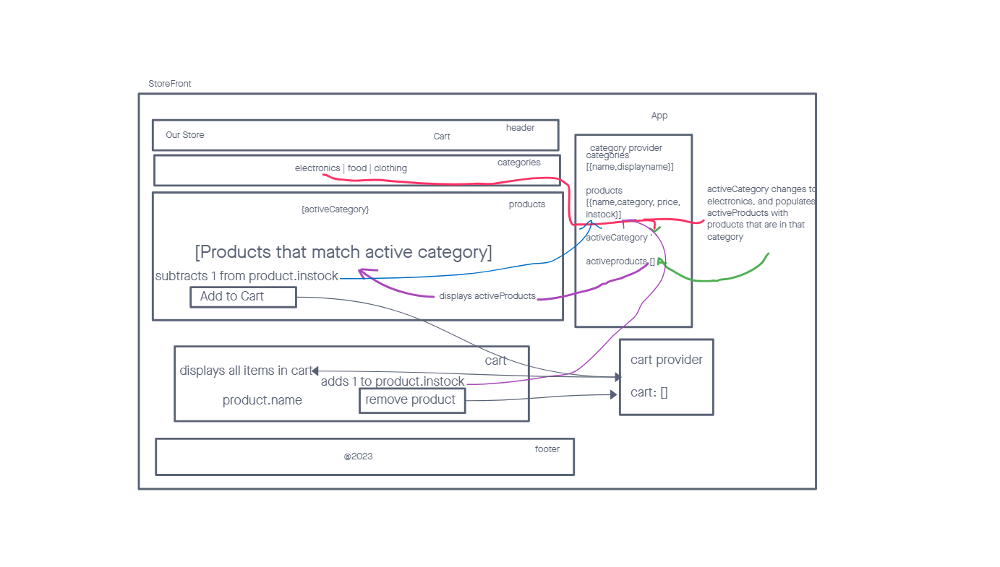

# LAB - Class 36

## Project: StoreFront

### Problem Domain

The problem domain for this React application is a storefront, where users can browse and purchase products. The application will be built in four phases, with Phase 1 focusing on setting up the basic scaffolding and initial styling of the application. The goal is to create a clean and easy-to-use user interface for browsing products.

### Documentation

Documentation for the application can be found in the README file. The prod deployment link, when applicable, will be provided in the "Links and Resources" section.

### Links and Resources

- [prod deployment](spp-storefront.netlify.app) (when applicable)

### Setup

#### How to initialize/run your application (where applicable)

In order to set up and run the application, it should be initialized using create-react-app. Material UI should also be installed as a dependency.

#### Features / Routes

The application will also use a Redux store to manage the state of categories and items in the store. The developer stories and technical requirements for this phase of the project include creating a visually appealing site using Material UI, displaying a list of categories from state, identifying the selected category and showing a list of products associated with the category, and creating a clean and easy-to-use user interface.

In phase 2, we will be adding the “Add to Cart” feature to our application, which will allow our users to not only browse items in the store, but also select them and have them persist in their “shopping cart” for later purchase.

#### Tests

I was assisted in writing tests by chatGPT, I wasn't sure what exactly I had to use to mock the stores and it really helped.

- tests for both reducers
- tests for each component, to see if everything renders correctly, and
  interacts with the provider from the redux reducer

### UML

#### Phase 1 UML

#### Phase 2 UML

